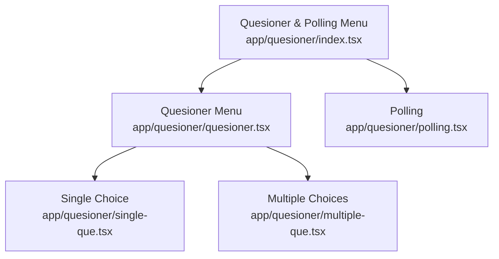

# Alur Quesioner & Polling

Dokumen ini merangkum alur kerja/navigasi, diagram sederhana, serta flow/alur kode untuk laman:
- app/quesioner/index.tsx
- app/quesioner/quesioner.tsx
- app/quesioner/single-que.tsx
- app/quesioner/multiple-que.tsx
- app/quesioner/polling.tsx

## 1) Alur kerja / navigasi

- Halaman utama menu fitur Quesioner & Polling berada di `app/quesioner/index.tsx`.
- Dari menu tersebut, user bisa memilih:
  - Quesioner (menu kumpulan soal) -> `app/quesioner/quesioner.tsx`
  - Polling -> `app/quesioner/polling.tsx`
- Di halaman Quesioner (`quesioner.tsx`), user memilih tipe soal:
  - Single Choice -> `app/quesioner/single-que.tsx`
  - Multiple Choices -> `app/quesioner/multiple-que.tsx`

Ringkas:
- Quesioner & Polling Menu -> (Quesioner -> Single/Multiple) atau (Polling)

## 2) Diagram sederhana

## 3) Flow / alur code per halaman

### app/quesioner/index.tsx
- Data menu disimpan di `MENU_DATA` (Quesioner, Polling) dengan route dan image.
- UI: `FlatList` 2 kolom menampilkan kartu menu.
- Navigasi menggunakan `Link` dari `expo-router`.

### app/quesioner/quesioner.tsx
- Data menu `MENU_DATA` untuk Single Choice & Multiple Choices.
- UI: `FlatList` 2 kolom menampilkan kartu pilihan.
- Navigasi menggunakan `Link` ke `single-que` atau `multiple-que`.

### app/quesioner/single-que.tsx
- State utama: `selectedSingle` (menyimpan pilihan per pertanyaan).
- `handleSingleSelect()` mengubah pilihan user.
- Render daftar soal:
  - Menandai opsi terpilih.
  - Menampilkan feedback benar/salah setelah ada pilihan.

### app/quesioner/multiple-que.tsx
- State utama:
  - `selectedMulti` untuk multi pilihan per pertanyaan.
  - `validatedQuestions` untuk menandai kapan validasi tampil.
- `handleMultiSelect()`:
  - Toggle pilihan (add/remove).
  - Validasi saat jumlah pilihan >= jumlah jawaban benar.
- Render soal:
  - Checkbox visual di tiap opsi.
  - Feedback benar/salah setelah validasi aktif.

### app/quesioner/polling.tsx
- State utama:
  - `selectedIndex` (pilihan user, hanya 1 kali).
  - `votes` (jumlah suara per opsi).
- `handleSelect()`:
  - Jika belum memilih, simpan pilihan dan tambahkan vote.
- `handleReset()`:
  - Reset pilihan dan vote ke nilai awal.
- Render:
  - List opsi polling.
  - Progress bar dan persentase suara.
  - Badge "Pilihan kamu" untuk opsi terpilih.
  - Tombol reset tampil jika sudah memilih.
